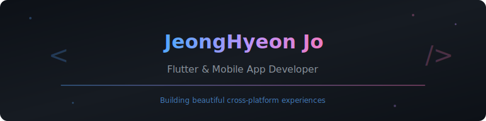

<div align="center">



<br/>

[](https://git.io/typing-svg)

<br/>

<a href="https://blog.naver.com/abeul_dv"></a>
<a href="https://velog.io/@abeul25/posts"></a>
<a href="https://www.youtube.com/@Abeul_"></a>

</div>

<br/>


<br/>

##  About Me

```yaml
name: 조정현 (JeongHyeon Jo)
role: Flutter & Mobile App Developer
education: 엘리스트랙 Flutter 앱개발 (최우수 수료)
motto: "깔끔한 코드, 아름다운 UI"
```

<br/>


<br/>

##  기술 스택

<div align="center">

<br/>

<table>
<tr>
<td align="center" width="50%">

### Mobile

<br/>


<br/>
<br/>


</td>
<td align="center" width="50%">

### Web

<br/>


<br/>
<br/>


</td>
</tr>
<tr>
<td align="center" colspan="2">

### Additional

<br/>


<br/>
<br/>


</td>
</tr>
</table>

<br/>

### 도구 & 환경


</div>

<br/>


<br/>

##  운영 중인 서비스

<div align="center">
<br/>

<a href="https://www.aimoeum.com"></a>

<br/>
<br/>

271개 이상의 AI 도구를 한국어로 소개하는 큐레이션 서비스를 직접 개발하고 운영하고 있습니다.

<br/>


</div>

<br/>


<br/>

##  GitHub Stats

<div align="center">
<br/>


<br/>


</div>

<br/>


<br/>

<details>
<summary><b>🏆 경력 & 수상 내역</b></summary>
<br/>

<div align="center">

### 교육


`2024.07 ~ 2024.12` | **최우수 수료**

<br/>

### 자격증


<br/>

### 수상

| 수상 내역 | 결과 |
|:---:|:---:|
| 엘리스 Flutter 트랙 1기 2차 프로젝트 | **최우수상 (1등)** |
| 엘리스 Flutter 트랙 1기 최종 프로젝트 | **대상 (1등)** |
| 엘리스 Flutter 트랙 1기 교육 이수 | **최우수상 (1등)** |

</div>

<br/>
</details>

<br/>


<br/>

<div align="center">


</div>
